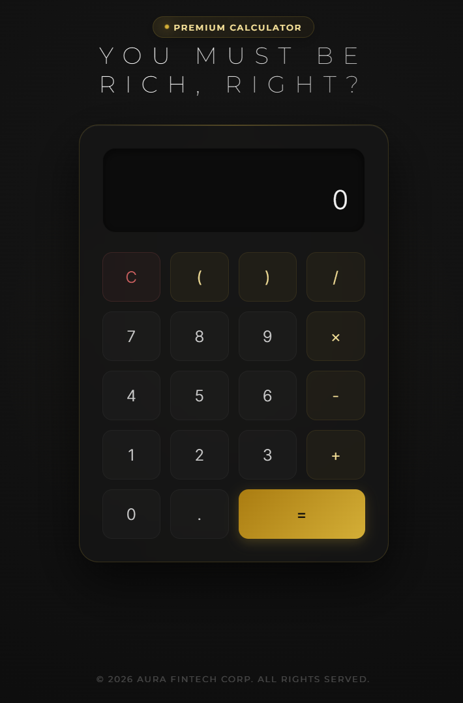
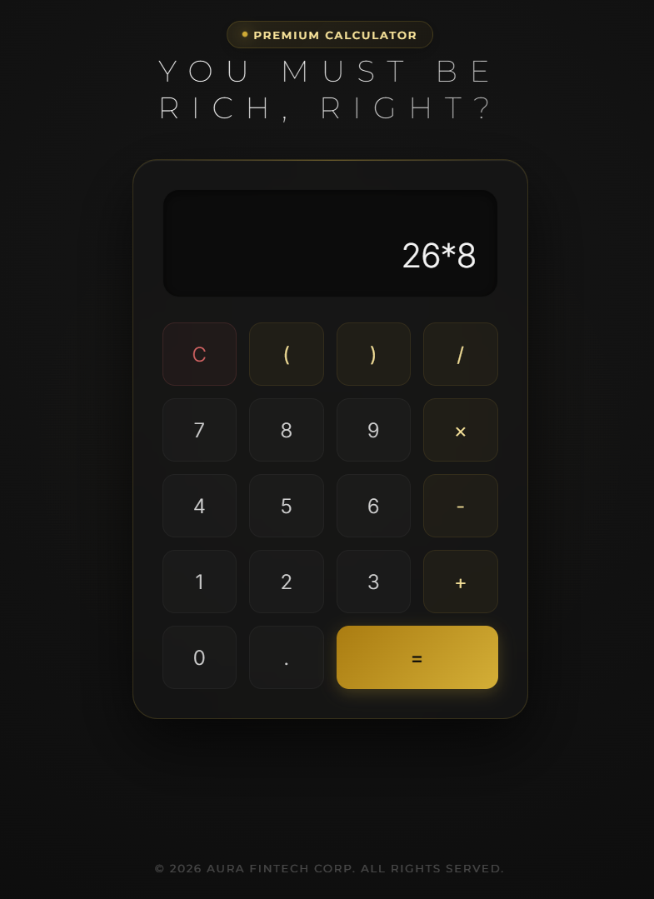
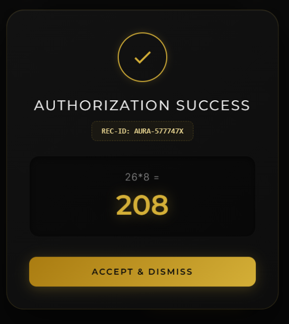

# ✨ AURA // Exclusive Premium Calculator

> "If you have to calculate, you probably can't afford it. But if you must, do it in absolute luxury."

An ultra-premium, high-fidelity luxury fintech calculation engine designed in **Obsidian Noir** with **Polished Gold accents** and modern glassmorphic aesthetics. Behind its visual excellence lies a chaotic-evil workflow: the calculator intercepts your math calculations and subjects you to a looping multi-stage payment gate before revealing the result.

---

## 💎 Features

* **Luxury Noir Design System**: Implemented using pure Vanilla CSS, HSL-tailored gold hues (`#D4AF37`, `#fbe69c`, `#aa7c11`), sleek glassmorphic overlays (`backdrop-filter: blur(25px)`), and radial dark ambient lighting.
* **Keyboard-Responsive Keypad**: Complete listener mapping for physical keyboard triggers (`0-9`, operators, `Backspace`, `Enter`, `Escape`) with dynamic click scales.
* **The Settlement Loop**: A custom JavaScript state machine that intercepts calculation results, requiring token authorization and card inputs.
* **Dynamic Card Visualizer**: A 2D card renderer that formats credit card spacing, limits, character masks, and expiration slashes in real-time as you fill the form.
* **Zero Dependencies**: Hand-crafted entirely using basic HTML5 semantic tags, custom CSS grid/flexboxes, and vanilla JavaScript.

---

## 📸 Interface Walkthrough

Here is the step-by-step settlement flow of your calculation:

### 1. Calculation Intercept
Perform your calculation using the luxury keypad. Pressing `=` or `Enter` immediately evaluates the computation in the background, locks the UI, and opens the AURA portal.
<br>


### 2. Stage 1: The Gate
You are greeted with a premium barrier requiring a `$4.99` computational fee to release the floating-point results.
<br>


### 3. Stage 2: Card Credentials Form
Enter cardholder data. The mock card display updates in real-time as inputs are received.
<br>


### 4. Settlement Loading
Submitting the form activates a luxury spin timer, masking transaction processing while simulating ledger authorization.
<br>


### 5. Stage 3: Computation Unlocked
The transaction is approved, a custom receipt code is generated, and the finalized equation result is displayed in a gold glow.
<br>


### 6. Reset & Clear
Dismissing the success modal resets all variables and sanitizes the screen memory back to `0`, allowing the user to start a new premium calculation loop.
<br>


---

## 🛠️ File Structure

The project has been split into clean modular components for easier maintenance:

```bash
d:/Ea-Calculator/
├── index.html     # Semantic HTML layout & container tags
├── style.css      # Luxury noir styling, responsive grids, and animations
├── script.js     # State machine loop and card visualizer logic
└── images/        # UI flow documentation screenshots
    ├── 1.png
    ├── 2.png
    ├── 3.png
    ├── 4.png
    ├── 5.png
    └── 6.png
```

---

## 🚀 How to Run

1. Clone or download the repository directory.
2. Locate and open `index.html` in any modern web browser.
3. No local build steps or package managers required. Pure frontend compute.

*Disclaimer: This is a design experiment. The secure settlement layer operates purely client-side; no actual credit card details are checked, validated, or sent over a network.*
